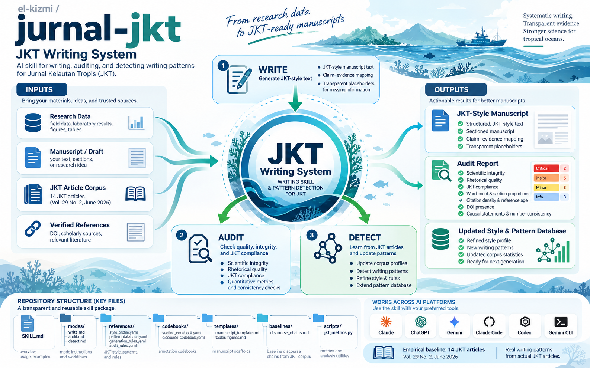

# JKT Writing System

**Skill AI untuk menulis, mengaudit, dan menganalisis pola naskah [Jurnal Kelautan Tropis (JKT)](https://ejournal2.undip.ac.id/index.php/jkt/index).**

Skill ini bekerja di **Claude (claude.ai)**, **ChatGPT**, **Google Gemini**, **Claude Code**, **Codex**, dan **Gemini CLI** — satu paket ZIP yang sama bisa diunggah ke semua platform tersebut.



*Ilustrasi skill JKT Writing System — visualisasi cara kerja menulis, mengaudit, dan menganalisis pola naskah Jurnal Kelautan Tropis dengan bantuan AI.*

---

## Daftar Isi

1. [Tentang Jurnal Kelautan Tropis](#1-tentang-jurnal-kelautan-tropis)
2. [Apa itu skill ini](#2-apa-ini-skill-ini)
3. [Isi paket skill](#3-isi-paket-skill)
4. [Cara mengunduh](#4-cara-mengunduh)
5. [Cara mengunggah ke Claude](#5-cara-mengunggah-ke-claude)
6. [Cara mengunggah ke ChatGPT](#6-cara-mengunggah-ke-chatgpt)
7. [Cara mengunggah ke Google Gemini](#7-cara-mengunggah-ke-google-gemini)
8. [Claude Code, Codex, dan Gemini CLI](#8-claude-code-codex-dan-gemini-cli)
9. [Cara memakai: 3 mode dan contoh prompt](#9-cara-memakai-3-mode-dan-contoh-prompt)
10. [Aturan yang dipegang skill](#10-aturan-yang-dipegang-skill)
11. [Memperbarui skill](#11-memperbarui-skill)
12. [Keterbatasan dan tanggung jawab](#12-keterbatasan-dan-tanggung-jawab)
13. [Struktur repositori](#13-struktur-repositori)
14. [Pemecahan masalah](#14-pemecahan-masalah)
15. [Lisensi dan kontak](#15-lisensi-dan-kontak)

---

## 1. Tentang Jurnal Kelautan Tropis

Skill ini dirancang khusus untuk **[Jurnal Kelautan Tropis (JKT)](https://ejournal2.undip.ac.id/index.php/jkt/index)** — jurnal ilmiah yang diterbitkan oleh **Departemen Ilmu Kelautan, Fakultas Perikanan dan Ilmu Kelautan, Universitas Diponegoro** bekerja sama dengan **Perhimpunan Pemeriksa Lingkungan Hidup Indonesia (INKALINDO)**.

| | |
|---|---|
| **Situs** | https://ejournal2.undip.ac.id/index.php/jkt/index |
| **P-ISSN** | 1410-8852 |
| **E-ISSN** | 2528-3111 |
| **Frekuensi terbit** | 3 kali setahun: Maret, Juni, November |
| **Terbit sejak** | 1998 (cetak); daring sejak 2015 (Vol. 18 No. 1) |
| **Akreditasi** | Nasional — SK Dirjen Dikti No. 295/C/C3/KPT/2026 (2 Januari 2026), berlaku Vol. 28 No. 1 (2025) – Vol. 32 No. 2 (2029) |
| **Lisensi** | CC BY-SA 4.0 |
| **Aliran** | Open access |

**Bidang kajiannya** mencakup: biologi laut, ekologi laut, geologi dan geodesi laut, perikanan laut (pengolahan, keragaman jenis, alat tangkap), oceanografi, polusi laut, penginderaan jauh laut, mikrobiologi laut, dan pengelolaan pesisir.

**Diindeks oleh:** DOAJ, Google Scholar, ROAD (ISSN), SINTA, CrossRef, Dimensions.

**Pedoman penulis (ringkasan — WAJIB dipatuhi):**

- Judul ≤ 12 kata, tanpa singkatan atau rumus
- Abstrak ≤ 250 kata, satu paragraf; 3–5 kata kunci
- Struktur: Introduction → Materials and Methods → **Results and Discussion (digabung)** → Conclusion → References
- Sitasi APA 7 (author–year; *et al.* untuk 3+ penulis)
- ≤ 10 halaman
- Naskah berbahasa Indonesia tetap wajib memiliki judul dan abstrak **Bahasa Inggris**

> **Selalu periksa ulang pedoman terbaru di laman [Author Guidelines](https://ejournal2.undip.ac.id/index.php/jkt/about/submissions#authorGuidelines) sebelum submit** — pedoman bisa berubah sewaktu-waktu. Skill ini mengacu pada pedoman per 23 September 2026.

---

## 2. Apa itu skill ini

Skill **`jkt-writing-system`** adalah paket instruksi + basis data pola + skrip pengukuran yang membuat AI menulis dan memeriksa naskah sesuai gaya JKT. Pengetahuannya bersifat **empiris**: diambil dari analisis korpus **14 artikel JKT Vol. 29 No. 2 (Juni 2026)** — bukan sekadar tebakan gaya.

Satu skill, **tiga mode**:

| Mode | Kapan dipakai | Hasil |
|---|---|---|
| **WRITE** | Punya data/catat penelitian dan ingin kerangka atau naskah | Teks sesuai gaya JKT + peta klaim–bukti + daftar data yang masih kurang |
| **AUDIT** | Punya naskah (.docx/.pdf/.txt) dan ingin diperiksa sebelum submit | Laporan audit: status naskah, temuan per tingkat keparahan, rencana revisi |
| **DETECT** | Punya kumpulan artikel JKT terbitan dan ingin memperbarui pola | Profil korpus + basis data pola yang diperbarui |

Skill memilih mode dari permintaan Anda. Jika permintaan ambigu, skill bertanya dulu: *"Mau saya tulis, audit, atau analisis korpus?"*

### Apa yang Anda dapat

**Mode WRITE**
- Teks sesuai pola JKT, misalnya Pendahuluan berbentuk corong (konteks → lokasi → gap kontrastif → *"Oleh karena itu"* → tujuan)
- Peta klaim–bukti dan catatan kepatuhan pedoman (kata judul, abstrak, kata kunci)
- Placeholder transparan untuk data yang belum Anda berikan, mis. `[REFERENCE REQUIRED]`, `[SAMPLE SIZE REQUIRED]` — skill **tidak pernah mengarang** angka atau sitasi

**Mode AUDIT**
- Pengukuran otomatis dengan `scripts/jkt_metrics.py`: jumlah kata, proporsi bagian, kepadatan sitasi, umur referensi, DOI, sisa draf proposal, kalimat kausal tanpa *hedging*, angka abstrak/kesimpulan yang tidak cocok dengan isi
- Audit tiga lapis: **integritas ilmiah → kualitas retoris → kesesuaian JKT**
- Status naskah: `AUDIT_READY` / `MINOR TECHNICAL REVISION` / `TARGETED`–`MAJOR`–`SUBSTANTIVE REVISION REQUIRED`
- Temuan terurut CRITICAL → MAJOR → MODERATE → MINOR, dengan lokasi, bukti, standar acuan, dan saran perbaikan

Skill **tidak** memberi skor tunggal dan **tidak** memprediksi peluang diterima.

---

## 3. Isi paket skill

```
jkt-writing-system/
├─ SKILL.md                        ← instruksi inti + pemilihan mode
├─ agents/openai.yaml              ← metadata tampilan untuk Codex/ChatGPT
├─ references/
│  ├─ mode_write.md                ← alur kerja menulis
│  ├─ mode_audit.md                ← alur kerja audit
│  ├─ mode_detect.md               ← alur kerja deteksi pola korpus
│  ├─ style_profile.yaml           ← profil gaya JKT (hasil analisis korpus)
│  ├─ pattern_database.yaml        ← pola, anti-pola, blueprint, kriteria audit AUD-01…30
│  ├─ generation_rules.yaml        ← aturan pembuatan teks
│  ├─ audit_rules.yaml             ← skala keparahan & format laporan audit
│  ├─ pattern_codebook.yaml        ← kode bersama: moves, gap, R&D, fungsi sitasi
│  ├─ annotation_codebook.yaml     ← manual anotasi operasional (untuk DETECT)
│  ├─ templates.md                 ← formulir input & kerangka laporan
│  └─ baseline_rd_chains.txt       ← kode wacana 187 paragraf R&D korpus baseline
└─ scripts/
   └─ jkt_metrics.py               ← pengukur otomatis naskah/korpus (Python 3, standard library)
```

File ZIP untuk unggah berisi **14 file** dengan struktur folder `jkt-writing-system/` di atas `SKILL.md`.

---

## 4. Cara mengunduh

> **Penting:** jangan klik **Code → Download ZIP** di halaman repo. Itu mengunduh *seluruh repo* (bernama `jurnal-jkt.zip`), yang **tidak bisa langsung diunggah** sebagai skill. Yang Anda butuhkan adalah file **`skill/dist/jkt-writing-system.zip`**.

### Langkah (download 1 file)

1. Buka file **[`skill/dist/jkt-writing-system.zip`](https://github.com/el-kizmi/jurnal-jkt/blob/master/skill/dist/jkt-writing-system.zip)** di GitHub.
2. Klik tombol **Download raw file** (atau **Download**).
3. Simpan `jkt-writing-system.zip` di komputer Anda.

### Cara alternatif: bangun sendiri dari sumber

Butuh Python 3:

```bash
git clone https://github.com/el-kizmi/jurnal-jkt.git
cd jurnal-jkt
python skill/build_and_install.py --zip-only
```

ZIP baru tersedia di `skill/dist/jkt-writing-system.zip` (perintah ini juga memvalidasi `SKILL.md`).

### Verifikasi struktur ZIP

Setelah diunduh, pastikan isi ZIP seperti berikut (SKILL.md ada di dalam folder `jkt-writing-system/`, bukan di root ZIP):

```
jkt-writing-system.zip
└─ jkt-writing-system/
   ├─ SKILL.md
   ├─ agents/openai.yaml
   ├─ references/…
   └─ scripts/jkt_metrics.py
```

---

## 5. Cara mengunggah ke Claude

Berlaku untuk **claude.ai**, aplikasi desktop, dan mobile.

1. Buka **claude.ai** → **Settings** → **Capabilities** → aktifkan **Code execution and file creation** (skill memerlukannya untuk menjalankan `jkt_metrics.py`).
2. Buka **Settings → Capabilities → Skills**, atau **Customize → Skills** (nama menu bisa berbeda menurut versi).
3. Klik **Upload skill** → pilih `jkt-writing-system.zip` → tunggu hingga skill muncul.
4. Pastikan toggle skill **aktif**.
5. Pakai dengan permintaan eksplisit agar skill dipanggil:

   ```
   pakai skill jkt-writing-system, audit naskah terlampir untuk submit ke JKT
   ```

**Untuk organisasi (Team/Enterprise):** admin dapat mengunggah skill agar tersedia bagi seluruh anggota.

---

## 6. Cara mengunggah ke ChatGPT

> Ketersediaan fitur **Skills** bergantung pada paket/langganan ChatGPT Anda.

1. Buka **ChatGPT** → menu **Skills** → **Create → Upload from your computer**.
2. Pilih `jkt-writing-system.zip`.
3. Setelah terunggah, panggil dengan:
   - `@jkt-writing-system` lalu tulis permintaan, atau
   - permintaan biasa (skill dipilih otomatis bila cocok dengan deskripsinya).

Contoh:

```
@jkt-writing-system Buatkan kerangka artikel JKT dari data terlampir:
struktur komunitas lamun di Pulau X, Mei–Juli 2025, 6 stasiun, bahasa Indonesia.
```

---

## 7. Cara mengunggah ke Google Gemini

Gemini mendukung unggah skill berupa file `SKILL.md` tunggal **atau** ZIP yang memuat `SKILL.md` di folder utamanya. Skill saat ini tersedia di **Gemini Spark** (gemini.google.com) dan **Gemini Enterprise**.

### Persyaratan unggahan Gemini

- `SKILL.md` harus berada di **root (folder utama)** isi ZIP
- Nama skill dalam frontmatter: huruf kecil + tanda hubung (`jkt-writing-system` ✅)
- Hanya file teks biasa: `.md`, `.py`, `.yaml`, `.json`, dll.
- **Tidak didukung:** `.pdf`, `.docx`, gambar, atau format biner
- Total ukuran ≤ 100 MB

### Masalah struktur ZIP dan cara mengatasinya

ZIP bawaan repo punya struktur `jkt-writing-system/SKILL.md` (ada satu level folder). Gemini mensyaratkan `SKILL.md` di **root** ZIP. Repack dulu sebelum unggah:

```powershell
# PowerShell (Windows) — repack agar SKILL.md ada di root ZIP
Compress-Archive -Path "jkt-writing-system\*" -DestinationPath "jkt-writing-system-gemini.zip"
```

```bash
# macOS / Linux
cd jkt-writing-system   # folder hasil ekstraksi
zip -r ../jkt-writing-system-gemini.zip .
```

Atau, jika hanya butuh `SKILL.md` saja (tanpa references — paling sederhana), unggah file `SKILL.md` langsung; catatan bahwa tanpa file referensi, gaya akan diikuti sebagian.

### Langkah unggah (Gemini Apps / Spark)

1. Buka **gemini.google.com** → sidebar → **Switch to Spark Skills** (buka halaman **Skills**).
2. Klik **Upload** di bagian atas.
3. Pilih `jkt-writing-system-gemini.zip` (hasil repack) → **Open**.
4. Tinjau skill, lalu klik **Create**.
5. Gunakan dalam percakapan: *"pakai skill jkt-writing-system, audit naskah ini untuk JKT"*.

### Gemini Enterprise

1. Navigation menu → **Skills** → ikon **+** → **Upload skill**.
2. Seret ZIP hasil repack → **Import** (skill aktif secara default).

### Catatan Gemini

- Skrip yang butuh **akses internet** tidak didukung; `jkt_metrics.py` berjalan lokal sehingga aman.
- Eksekusi Python/Bash didukung di lingkungan yang mengizinkannya; tanpa eksekusi kode, skill menghitung metrik secara manual dan menyatakannya.
- Dokumentasi resmi: [Create & manage skills for Gemini Apps](https://support.google.com/gemini/answer/17094296).

---

## 8. Claude Code, Codex, dan Gemini CLI

| Platform | Cara pasang | Cara panggil |
|---|---|---|
| **Claude Code** | `python skill/build_and_install.py` (pasang ke `~/.claude/skills/`) atau unggah ZIP via UI skills | `/jkt-writing-system` atau permintaan biasa: *"audit naskah saya untuk JKT"* |
| **Codex** (CLI/IDE/desktop) | `python skill/build_and_install.py` (pasang ke `~/.agents/skills/`) | `$jkt-writing-system` atau lihat daftar: `/skills` |
| **Gemini CLI** | Salin folder skill ke `.gemini/skills/jkt-writing-system/` (atau `~/.gemini/skills/` untuk user scope) | `/skills list` untuk verifikasi; `/skills reload` bila perlu; aktifkan skill bila diminta `/trust` |

### Instalasi sekali jalan (Claude Code + Codex)

```bash
# dari root repo
python skill/build_and_install.py

# opsi: sekalian pasang ke satu proyek (membuat .claude/skills dan .agents/skills)
python skill/build_and_install.py --project C:\path\ke\proyek
```

Perintah ini: **validasi** `SKILL.md` → **bangun ulang ZIP** → **pasang** salinan ke `~/.claude/skills/` dan `~/.agents/skills/`.

---

## 9. Cara memakai: 3 mode dan contoh prompt

### 9.1 WRITE — menulis naskah

**Siapkan sebanyak mungkin dari daftar ini** (skill akan menanyakan yang kurang):

- Topik, objek, lokasi (situs/kabupaten/provinsi), periode sampling, bahasa naskah
- Masalah, gap (yang sudah diketahui vs yang belum), tujuan O1, O2, …
- Desain dan teknik sampling, jumlah stasiun/sampel, alat (tipe), rumus/indeks, uji statistik, perangkat lunak + versi
- Tabel atau angka hasil
- **Daftar pustaka terverifikasi** (penulis, tahun, judul, jurnal, DOI) beserta temuan relevannya — skill tidak mengarang sitasi

**Contoh prompt:**

```
Pakai skill jkt-writing-system. Buatkan kerangka (planning only) artikel
dari data terlampir: struktur komunitas lamun di Pulau X, Mei–Juli 2025,
6 stasiun, bahasa Indonesia.
```

```
Tulis bagian Hasil dan Pembahasan dari Tabel 1–3 berikut, gaya JKT,
bahasa Inggris. Referensi yang boleh dipakai: [tempel daftar].
```

```
Buat draf lengkap (traceable draft) dari catatan penelitian saya.
Tampilkan peta klaim–bukti.
```

**Mode keluaran:** `planning_only` · `section_draft` · `full_draft` · `traceable_draft` · `clean_manuscript`.

### 9.2 AUDIT — memeriksa naskah

```
Audit naskah terlampir untuk submit ke Jurnal Kelautan Tropis.
Laporan dalam bahasa Indonesia.
```

```
Periksa khusus bagian Pembahasan dan Kesimpulan: kedalaman diskusi,
klaim kausal, kesesuaian dengan tujuan.
```

```
Perbaiki temuan CRITICAL dan MAJOR saja, lalu audit ulang.
```

**Menjalankan pengukuran sendiri tanpa AI** (Python 3):

```bash
python skill/jkt-writing-system/scripts/jkt_metrics.py manuscript naskah.docx --year 2026
```

Hasil berupa tabel PASS / FLAG / VERIFY:

- **FLAG** — melanggar pedoman atau di luar rentang korpus → wajib dicek
- **VERIFY** — perlu pembacaan manual (kalimat kausal, angka yang tidak cocok)

> Gunakan judul bagian standar (PENDAHULUAN / MATERI DAN METODE / HASIL DAN PEMBAHASAN / KESIMPULAN / DAFTAR PUSTAKA, atau padanan Inggrisnya) agar skrip memisahkan bagian dengan benar.

**Deteksi naskah (.docx) butuh parser:** pastikan `python-docx` terpasang, atau simpan naskah sebagai `.txt`. Untuk `.pdf` dibutuhkan `pdftotext` (poppler).

### 9.3 DETECT — memperbarui pola dari korpus

1. Kumpulkan PDF artikel JKT dalam satu folder, mis. `korpus_2024\`.
2. Minta:

   ```
   Pakai skill jkt-writing-system mode DETECT pada folder korpus_2024.
   Gabungkan dengan baseline Vol. 29(2) dan perbarui style_profile.yaml
   serta pattern_database.yaml. Sisihkan 15% artikel sebagai holdout.
   ```

3. Skill memberi *Corpus Intake Report*, menjalankan metrik, mengodekan retorika sesuai `annotation_codebook.yaml`, lalu memperbarui file profil.
4. Setelah file diperbarui: `python skill/build_and_install.py` → unggah ulang ZIP ke claude.ai / ChatGPT / Gemini.

**Target:** ≥ 30 artikel dari ≥ 2 tahun (idealnya 50–100) dengan validasi holdout. Setelah itu status pola bisa naik dari **PROVISIONAL** → **VALIDATED**.

---

## 10. Aturan yang dipegang skill

1. **Urutan prioritas:** validitas ilmiah → keterlacakan bukti → logika penelitian → pedoman JKT → pola JKT → kehalusan bahasa. Pola gaya tidak pernah menimpa syarat ilmiah atau etika.
2. **Tidak pernah mengarang** angka, statistik, jumlah sampel, alat, koordinat, spesies, DOI, atau referensi. Data yang kurang ditandai placeholder.
3. **Setiap sitasi harus nyata dan terlacak** ke sumber yang Anda berikan atau yang diverifikasi. Setiap penjelasan pembahasan diikuti sumber (P(citation | explanation) = 0,71 pada korpus).
4. **Kontrol kausalitas.** Desain observasional/korelasional memakai kata asosiatif atau *hedged* (*was associated with, may reflect, diduga berkaitan dengan*). Kata kausal butuh desain eksperimen, uji statistik, atau mekanisme bersitasi. Pelanggaran pada ≥ 7 dari 14 artikel korpus — ini titik periksa utama.
5. **Satu sumber untuk setiap angka.** Abstrak, tujuan, hasil, dan kesimpulan harus memakai angka identik. 4 dari 14 artikel terbit melanggar aturan ini.
6. **Pisahkan lapisan bukti:** aturan ditandai GUIDELINE (pedoman jurnal), CORPUS (pola teramati), DOMAIN (metode), atau LANGUAGE (EN vs ID). Pola korpus tidak pernah disajikan sebagai syarat jurnal.
7. **Status provisional.** Profil dari satu terbitan (Vol. 29 No. 2, 2026; n = 14). Pola CORE diberlakukan sebagai SHOULD, bukan MUST. Hanya aturan pedoman yang MUST.
8. **Prosa original.** Belajar fungsi dan urutan — tidak pernah menyalin kalimat dari artikel terbit.
9. **Bahasa.** Balasan mengikuti bahasa Anda; naskah ditulis dalam bahasa yang Anda pilih; naskah Indonesia tetap perlu judul + abstrak Inggris.

---

## 11. Memperbarui skill

```bash
# 1. Edit file di skill/jkt-writing-system/
# 2. Validasi + bangun ulang ZIP + pasang ulang ke Claude Code & Codex
python skill/build_and_install.py

# 3. Commit & push
git add skill/
git commit -m "Update jkt-writing-system skill"
git push

# 4. Unduh ZIP baru dari GitHub, hapus versi lama di platform,
#    lalu unggah ulang ke claude.ai / ChatGPT / Gemini
```

---

## 12. Keterbatasan dan tanggung jawab

- Profil gaya berasal dari **satu terbitan** (Vol. 29 No. 2, 2026; 14 artikel; 5 di antaranya dari klaster penulis Undip). Semua pola berstatus **PROVISIONAL**.
- Pedoman penulis diambil dari laman JKT per **23 September 2026**. **Periksa ulang** sebelum submit.
- `jkt_metrics.py` adalah penyaring heuristik; pembacaan PDF dua kolom bisa menggeser hitungan referensi ±1–2. Setiap FLAG/VERIFY perlu dicek manual.
- Di ChatGPT/claude.ai/Gemini **tanpa eksekusi kode**, skill mengukur secara manual dan menyatakannya.
- Skill ini **membantu penyusunan dan pemeriksaan**, bukan menjamin penerimaan naskah. Keputusan editorial sepenuhnya berada pada jurnal.
- Status akreditasi dan pedoman resmi selalu rujuk langsung ke [laman JKT](https://ejournal2.undip.ac.id/index.php/jkt/index).

---

## 13. Struktur repositori

```
jurnal-jkt/
├─ README.md                        ← dokumen ini
├─ skill/
│  ├─ PANDUAN_PENGGUNAAN.md         ← panduan lengkap (Bahasa Indonesia)
│  ├─ build_and_install.py          ← validasi + ZIP + instalasi lokal
│  ├─ dist/jkt-writing-system.zip   ← ★ file untuk diunggah ke Claude/ChatGPT/Gemini
│  ├─ images/jkt.png                ← ilustrasi skill (dipakai di README ini)
│  └─ jkt-writing-system/           ← sumber skill (edit di sini)
├─ jkt_pattern_detection/           ← hasil analisis pola korpus (artikel_profiles.yaml, report.html)
├─ pattern/                         ← codebook & aturan pola sumber
└─ document (2)–(16).pdf            ← korpus baseline JKT Vol. 29(2) 2026
```

Dokumen pendukung:

- [`skill/PANDUAN_PENGGUNAAN.md`](skill/PANDUAN_PENGGUNAAN.md) — panduan penggunaan detail
- [`jkt_pattern_detection/article_profiles.yaml`](jkt_pattern_detection/article_profiles.yaml) — profil 14 artikel korpus (metadata, move sequence, gap, anomali)
- [`jkt_pattern_detection/report.html`](jkt_pattern_detection/report.html) — laporan analisis pola

---

## 14. Pemecahan masalah

| Masalah | Solusi |
|---|---|
| Skill tidak terpanggil otomatis | Sebut eksplisit: *"pakai skill jkt-writing-system"*; `/jkt-writing-system` (Claude Code); `$jkt-writing-system` (Codex); `@jkt-writing-system` (ChatGPT) |
| Unggahan ZIP ditolak | Pastikan yang diunggah `dist/jkt-writing-system.zip`, **bukan** `jurnal-jkt.zip` (ZIP repo) dan **bukan** folder `skill/` |
| ZIP ditolak di Gemini | Repack agar `SKILL.md` ada di root ZIP (lihat [bagian 7](#7-cara-mengunggah-ke-google-gemini)) |
| `pdftotext not found` | Pasang [poppler](https://poppler.freedesktop.org/), atau simpan naskah sebagai .docx/.txt |
| Bagian naskah tidak terdeteksi skrip | Gunakan judul bagian standar di baris tersendiri |
| Perubahan skill tidak muncul | Jalankan ulang `build_and_install.py`, buka sesi baru, unggah ulang ZIP di claude.ai/ChatGPT/Gemini |
| Toggle eksekusi kode mati | Aktifkan *Code execution and file creation* (Claude) atau setara di platform lain |

---

## 15. Lisensi dan kontak

- **Konten jurnal & artikel korpus:** milik penulis/jurnal masing-masing, di bawah [CC BY-SA 4.0](http://creativecommons.org/licenses/by-sa/4.0/) — sitasi wajib, dilarang menyalin kalimat artikel terbit ke naskah baru.
- **Kode dan basis data pola skill:** tersedia dari repositori ini; gunakan dan modifikasi dengan atribusi ke repositori ini.
- **Kontak jurnal:** j.kelautantropis@gmail.com — Departemen Ilmu Kelautan, FPIK Universitas Diponegoro, Gedung B, Jl. Prof. H. Soedarto SH, Tembalang, Semarang 50275.

---

*Skill dikembangkan dari analisis korpus Jurnal Kelautan Tropis Vol. 29 No. 2 (Juni 2026). Bukan produk resmi Universitas Diponegoro maupun JKT.*
